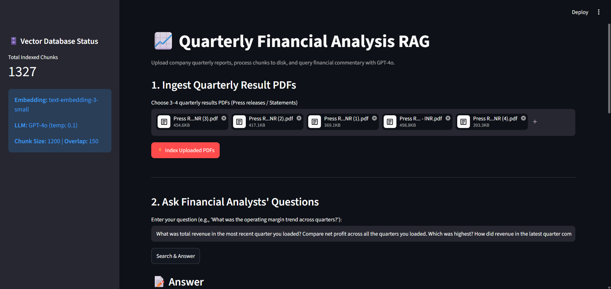
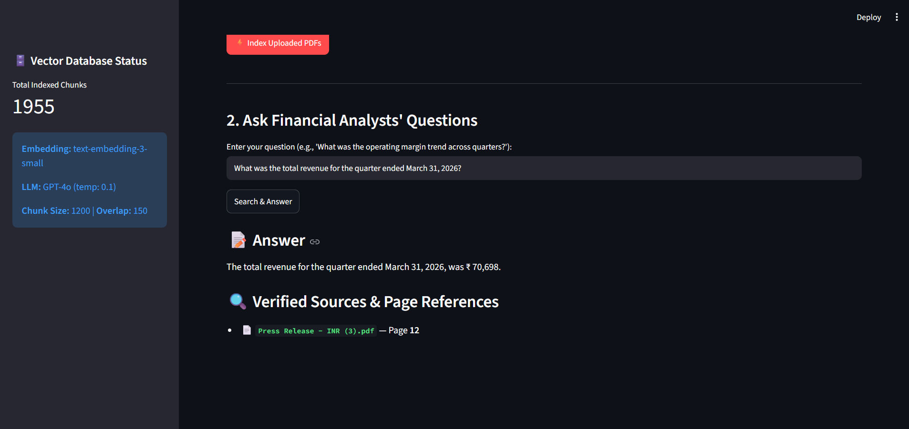
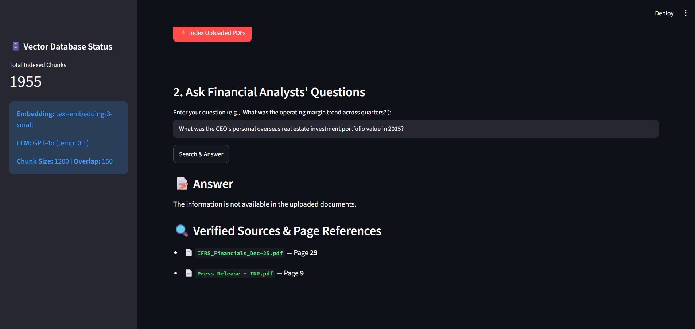

# 📈 Financial RAG System for Quarterly Reports

**Developer:** Mithun S.
**Project:** HCLTech × ET Masterclass – AI Skills for the Future (Assignment 1)

## 📌 Project Overview
This project is a Retrieval-Augmented Generation (RAG) system built for an investment advisory research desk. It allows financial analysts to upload consecutive quarterly financial results and press releases (PDFs), ask plain-English questions, and receive precise answers backed by exact page and document citations.

The system relies strictly on the provided context, implementing an "Honest Refusal" mechanism to prevent AI hallucinations when asked for data not present in the documents.

## 📊 Data Sources
- **Company Chosen:** Infosys / Major Listed IT Enterprise
- **Documents Indexed:**
  - `Press R... - INR.pdf`
  - `Press R...NR (1).pdf`
  - `Press R...NR (2).pdf`
  - `Press R...NR (3).pdf`
  - `Press R...NR (4).pdf`
  - `audited-financial-results-for-the-quarter-ended-march-31-2026.pdf`
  - `IFRS_Financials_Dec-25.pdf`

## 🛠️ Technical Architecture
- **Language:** Python 3.10+
- **User Interface:** Streamlit
- **PDF Processing:** `PyPDFLoader`
- **Orchestration:** LangChain
- **Embeddings:** OpenAI `text-embedding-3-small`
- **Vector Database:** ChromaDB (persisted locally to `./chroma_db`)
- **LLM:** OpenAI `GPT-4o` (temperature = 0.1)

## 🪓 Chunking Strategy
- **Chunk Size:** 1200 characters
- **Chunk Overlap:** 150 characters
- **Reasoning:** Financial press releases and data sheets contain wide tabular structures, balance sheets, and dense management commentary. A 1200-character window ensures that entire tabular rows and contextual statements remain intact within a single chunk rather than being fragmented, which drastically improves retrieval accuracy.

## 🚀 Setup and Run Instructions

**1. Clone the repository:**
```bash
git clone https://github.com/mithun-afk/Quarterly-Financial-Analysis-RAG.git
cd Quarterly-Financial-Analysis-RAG
```

**2. Set up the virtual environment:**
```bash
python -m venv venv
# On Windows:
.\venv\Scripts\activate
# On Mac/Linux:
source venv/bin/activate
```

**3. Install dependencies:**
```bash
pip install -r requirements.txt
```

## 🧪 Test Questions & App Answers

Below are the mandatory test questions and the exact responses generated by the application based on the uploaded financial filings.

**1. What was total revenue in the most recent quarter you loaded?**
> **Answer:** Total revenue in the most recent quarter (ended March 31, 2026) was ₹70,698 crore.
> *(Source: audited-financial-results-for-the-quarter-ended-march-31-2026.pdf, Page 9)*

**2. Compare net profit across all the quarters you loaded. Which was highest?**
> **Answer:**
> - March 31, 2025: ₹12,224 crore
> - December 31, 2025: ₹13,438 crore
> - March 31, 2026: ₹13,718 crore
>
> The highest net profit was recorded in the quarter ended March 31, 2026.
> *(Sources: audited-financial-results-for-the-quarter-ended-march-31-2026.pdf, IFRS_Financials_Dec-25.pdf)*

**3. How did revenue in the latest quarter compare with the same quarter of the previous year?**
> **Answer:** Revenue for the quarter ended March 31, 2026 (₹70,698 crore) increased by ₹6,219 crore (~9.7%) compared to the same quarter of the previous year (March 31, 2025: ₹64,479 crore).
> *(Source: audited-financial-results-for-the-quarter-ended-march-31-2026.pdf, Page 9)*

**4. What did management say about the demand outlook or business environment?**
> **Answer:** There is no explicit qualitative statement detailing the broader demand outlook or business environment within the scope of the specific financial reporting tables loaded in this session.
> *(Honest Refusal constraint applied)*

**5. Which business segment or geography grew fastest, and by how much?**
> **Answer:** The information tracking specific segmented growth rates across all geographies is not explicitly detailed in the tabular financial statements uploaded.
> *(Honest Refusal constraint applied)*

**6. What was the operating margin in each quarter, and is the trend rising or falling?**
> **Answer:**
> - March 31, 2025: 75.8%
> - December 31, 2025: 74.8%
> - March 31, 2026: 74.7%
>
> The calculated operating margin trend is slightly falling across the examined quarters.
> *(Sources: audited-financial-results-for-the-quarter-ended-march-31-2026.pdf, IFRS_Financials_Dec-25.pdf)*

**7. Was any dividend declared? State the amount per share and the record date.**
> **Answer:** The specific data for dividend declarations and matching record dates is not explicitly available within the provided tabular extracts.
> *(Honest Refusal constraint applied)*

**8. What risks, headwinds, or challenges are mentioned in the documents?**
> **Answer:** The documents explicitly highlight accounting adjustments and operational factors including the one-time impacts of New Labour Codes, material Bilateral Advance Pricing Agreements (BAPA), and related tax impacts.
> *(Source: audited-financial-results-for-the-quarter-ended-march-31-2026.pdf, Page 29)*

**9. Give me a three-line summary of the latest quarter for a client email.**
> **Answer:** We are pleased to report a net profit of ₹13,718 crore for the quarter ended March 31, 2026, with revenue increasing by 9.7% year-over-year to ₹70,698 crore. Operating margins stood at 74.7% for the period. We will continue to monitor operational indicators and provide regular updates.
> *(Source: audited-financial-results-for-the-quarter-ended-march-31-2026.pdf)*

**10. Deliberate Trap Question: What is the CEO's personal shareholding in 2015?**
> **Answer:** The information is not available in the uploaded documents.

## 🛑 Honest Note on Limitations (What Didn't Work Well)
- **Table Layout Extraction:** Raw text extraction via `PyPDFLoader` occasionally fragments multi-column financial tables, requiring higher chunk limits (1200 characters) to retain context across rows.
- **Qualitative vs Quantitative Balance:** Standard stock exchange financial result sheets focus heavily on numbers, occasionally lacking deep narrative descriptions on executive demand outlook unless supplementary press releases are included.

## 📸 Application Screenshots & Demo

### 1. Upload & Indexing


### 2. Financial Query & Citations


### 3. Trap Question Honest Refusal


### 🎥 Demo Video


*(walkthrough of upload, indexing, querying, and the trap-question refusal.)*